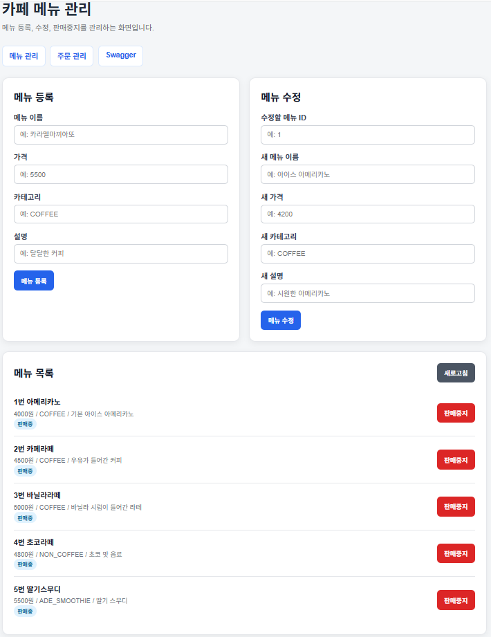
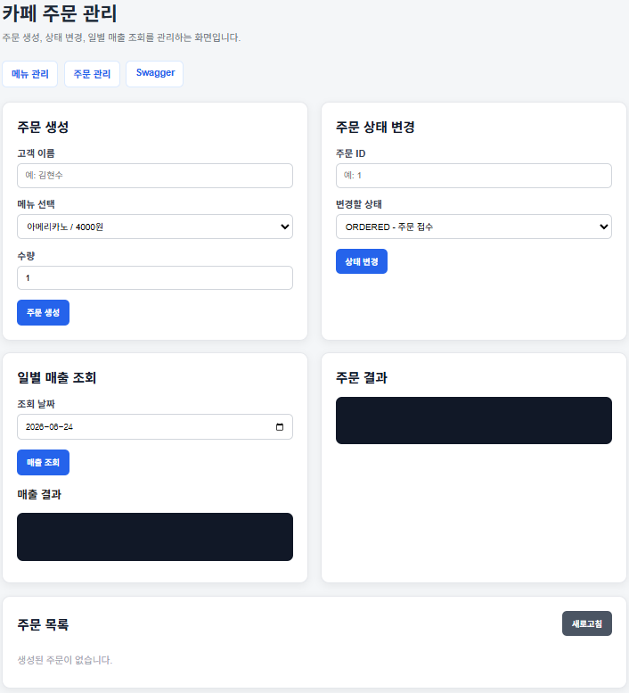
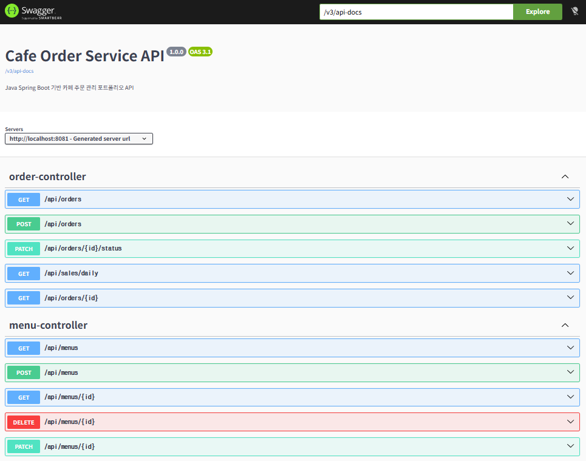

# Cafe Order Service

Java Spring Boot 기반 카페 주문 관리 포트폴리오 프로젝트입니다.
메뉴 관리, 주문 생성, 주문 상태 변경, 일별 매출 조회 기능을 REST API로 구현했습니다.

## 프로젝트 개요

이 프로젝트는 카페에서 사용할 수 있는 간단한 주문 관리 시스템입니다.

관리자는 메뉴를 등록, 수정, 판매중지할 수 있고, 고객 주문을 생성한 뒤 주문 상태를 변경할 수 있습니다. 또한 날짜별 주문 매출을 조회할 수 있습니다.

## 개발 목적

Python과 AI 중심 프로젝트 외에 Java와 Spring Boot 기반 백엔드 개발 역량을 보여주기 위해 제작했습니다.

특히 아래 내용을 보여주는 것을 목표로 했습니다.

* Spring Boot REST API 구현
* JPA를 활용한 데이터 저장과 조회
* 메뉴, 주문, 주문 상세 엔티티 설계
* 주문 생성 시 서버 기준 가격 계산
* 주문 상태 변경 로직 구현
* 공통 예외 처리
* Swagger API 문서화

## 기술 스택

* Java 17
* Spring Boot 3.5.15
* Spring Web
* Spring Data JPA
* H2 Database
* Lombok
* Bean Validation
* Swagger

## 실행 화면

### 메뉴 관리 화면



### 주문 관리 화면



### Swagger API 문서



## 주요 기능

### 메뉴 관리

* 메뉴 목록 조회
* 메뉴 상세 조회
* 메뉴 등록
* 메뉴 수정
* 메뉴 판매중지

### 주문 관리

* 주문 생성
* 주문 목록 조회
* 주문 상세 조회
* 주문 상태 변경

### 매출 관리

* 일별 매출 조회
* 취소된 주문은 매출에서 제외

## 핵심 구현 내용

### 1. 서버 기준 주문 금액 계산

주문 요청에서는 메뉴 가격을 받지 않고, `menuId`와 `quantity`만 받습니다.
서버에서 DB에 저장된 메뉴 가격을 조회한 뒤 주문 금액을 계산합니다.

```text
메뉴 가격 x 수량 = 주문 상세 금액
주문 상세 금액 합계 = 주문 총액
```

이를 통해 사용자가 임의로 가격을 조작하는 문제를 막을 수 있도록 구현했습니다.

### 2. 주문 당시 메뉴 정보 저장

주문 상세에는 메뉴 ID뿐 아니라 주문 당시의 메뉴명과 가격도 함께 저장합니다.

```text
menuId
menuName
orderPrice
quantity
subtotalPrice
```

이렇게 하면 나중에 메뉴 가격이나 이름이 바뀌어도 과거 주문 내역의 금액과 메뉴 정보를 유지할 수 있습니다.

### 3. 메뉴 판매중지 처리

메뉴 삭제는 실제 삭제가 아니라 `active = false`로 처리했습니다.
기존 주문 데이터와의 연결을 유지하기 위해 실제 삭제보다 판매중지 방식으로 구현했습니다.

### 4. 주문 상태 변경

주문 상태는 enum으로 관리했습니다.

```text
ORDERED
MAKING
COMPLETED
CANCELED
```

완료되었거나 취소된 주문은 다시 상태를 변경할 수 없도록 제한했습니다.

### 5. 공통 예외 처리

존재하지 않는 메뉴나 주문을 조회할 경우, 에러를 JSON 형태로 반환하도록 공통 예외 처리를 적용했습니다.

예시:

```json
{
  "timestamp": "2026-06-23T15:30:00",
  "status": 400,
  "message": "존재하지 않는 주문입니다."
}
```

## API 목록

### 메뉴 API

| Method | URL             | 설명       |
| ------ | --------------- | -------- |
| GET    | /api/menus      | 메뉴 목록 조회 |
| GET    | /api/menus/{id} | 메뉴 상세 조회 |
| POST   | /api/menus      | 메뉴 등록    |
| PATCH  | /api/menus/{id} | 메뉴 수정    |
| DELETE | /api/menus/{id} | 메뉴 판매중지  |

### 주문 API

| Method | URL                     | 설명       |
| ------ | ----------------------- | -------- |
| POST   | /api/orders             | 주문 생성    |
| GET    | /api/orders             | 주문 목록 조회 |
| GET    | /api/orders/{id}        | 주문 상세 조회 |
| PATCH  | /api/orders/{id}/status | 주문 상태 변경 |

### 매출 API

| Method | URL                              | 설명       |
| ------ | -------------------------------- | -------- |
| GET    | /api/sales/daily?date=2026-06-23 | 일별 매출 조회 |

## 실행 방법

프로젝트 폴더에서 아래 명령어를 실행합니다.

```bash
.\mvnw.cmd spring-boot:run
```

서버 실행 후 아래 주소로 접속할 수 있습니다.

```text
메뉴 관리 화면
http://localhost:8081/menu.html

주문 관리 화면
http://localhost:8081/order.html

Swagger API 문서
http://localhost:8081/swagger-ui/index.html

H2 Console
http://localhost:8081/h2-console
```

## H2 접속 정보

```text
JDBC URL: jdbc:h2:mem:cafedb
User Name: sa
Password: 비워두기
```

## 프로젝트 구조

```text
src/main/java/com/portfolio/cafeorderservice
 ├── common
 │   ├── ErrorResponse.java
 │   └── GlobalExceptionHandler.java
 ├── config
 │   └── OpenApiConfig.java
 ├── controller
 │   └── HomeController.java
 ├── menu
 │   ├── Menu.java
 │   ├── MenuController.java
 │   ├── MenuCreateRequest.java
 │   ├── MenuRepository.java
 │   ├── MenuService.java
 │   └── MenuUpdateRequest.java
 ├── order
 │   ├── CafeOrder.java
 │   ├── CafeOrderRepository.java
 │   ├── OrderController.java
 │   ├── OrderCreateRequest.java
 │   ├── OrderItem.java
 │   ├── OrderResponse.java
 │   ├── OrderService.java
 │   ├── OrderStatus.java
 │   ├── OrderStatusUpdateRequest.java
 │   └── SalesResponse.java
 ├── CafeOrderServiceApplication.java
 └── DataLoader.java
```

## 트러블슈팅

### 1. 주문 금액을 클라이언트에서 받으면 조작 가능성이 있는 문제

처음에는 주문 요청에서 가격을 함께 받을 수도 있다고 생각했습니다.
하지만 클라이언트에서 가격을 보내면 사용자가 임의로 가격을 바꿔 요청할 수 있습니다.

그래서 주문 요청에서는 `menuId`와 `quantity`만 받고, 서버에서 DB의 메뉴 가격을 조회해 총 금액을 계산하도록 구현했습니다.

### 2. 메뉴를 실제 삭제하면 과거 주문 정보가 깨질 수 있는 문제

메뉴를 실제로 삭제하면 과거 주문에서 어떤 메뉴를 주문했는지 확인하기 어려워질 수 있습니다.

그래서 메뉴는 실제 삭제하지 않고 `active = false`로 판매중지 처리했습니다.
또한 주문 상세에는 주문 당시의 메뉴명과 가격을 따로 저장했습니다.

## 이력서용 요약

Spring Boot와 JPA를 사용해 카페 주문 관리 REST API를 구현했습니다. 메뉴, 주문, 주문 상세 엔티티를 설계하고, 주문 생성 시 DB 메뉴 가격 기준으로 총 금액을 계산하도록 구현했습니다. 또한 주문 상태 변경, 메뉴 판매중지, 일별 매출 조회, 공통 예외 처리, Swagger 문서화를 적용해 API 안정성과 유지보수성을 높였습니다.
